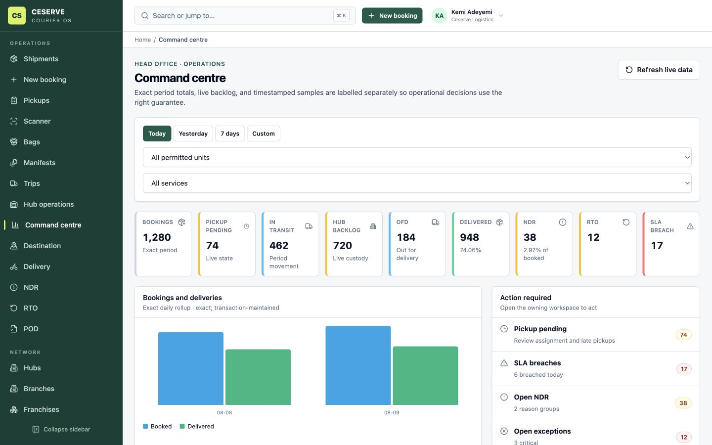
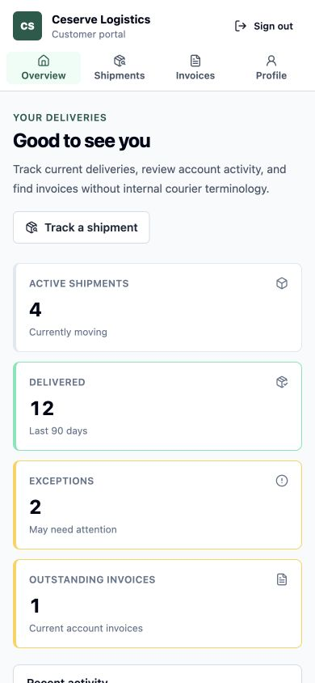

# Release 4 frontend completion report

Date: 2026-08-09

Status: **implemented against the final Release 4 OpenAPI contract.** M26–M32
are represented by permission-aware, contract-backed UI. The remaining backend
capability boundaries are visible to users rather than filled with fabricated
frontend behaviour; they are listed in
[`docs/frontend-backend-gaps/release-4.md`](../frontend-backend-gaps/release-4.md).

Nigeria is the deployment default: money uses NGN/en-NG, application dates use
Africa/Lagos/en-NG, portal copy and fixtures use Nigerian locations, and signs,
statuses, HTTP results, and finance meanings never depend on colour alone.
Cross-release frontend copy now uses naira, postal code, TIN, and CAC/RC
terminology rather than rupee, PIN code, GSTIN, and PAN labels.

## 1. Routes and pages added

### Notifications

- `/admin/notifications/templates` — searchable template register, create/edit,
  derived variable references, backend preview, and activation state.
- `/admin/notifications/triggers` — event-by-channel coverage matrix.
- `/admin/notifications/channels` — registered-adapter and 24-hour health view.
- `/admin/notifications/deliveries` — filterable delivery-attempt register.
- `/admin/notifications/deliveries/:notificationId` — rendered message,
  provider attempt history, retry/cancel eligibility, and shipment reference.

### Customer portal

- `/portal/customer` — separate customer shell, account dashboard, active,
  delivered, exception, invoice, and recent-activity position.
- `/portal/customer/shipments` and
  `/portal/customer/shipments/:shipmentId` — account-scoped history and
  customer-safe tracking.
- `/portal/customer/invoices` — invoice/payment position in NGN.
- `/portal/customer/profile` — linked customer accounts and credit position.

### Franchise portal

- `/portal/franchise` — dedicated commercial dashboard and role-aware quick
  actions.
- `/portal/franchise/shipments` — explicit ORIGIN/DESTINATION/ANY relationship.
- `/portal/franchise/settlements` — own-franchise settlement position.
- `/portal/franchise/profile` — subject binding and access context.

### Operations, reporting, and integrations

- `/operations/hub` — enhanced with the dedicated facility-bound terminal app.
- `/command-centre` — head-office KPI, consistency, filter, action, backlog,
  movement, facility, and service workspace.
- `/reports` — grouped catalogue, bounded run form, lifecycle monitoring,
  cancellation, and completed-file download.
- `/admin/integrations/api-keys`, `/admin/integrations/webhooks`, and
  `/admin/integrations/webhooks/deliveries` retain the Release 4 integration
  workspace with corrected server pagination.

Customer and franchise routes use their own shells outside the internal
`AppShell`. Login directs bound subjects to the correct portal. A staff user
with a portal permission but no customer subject is refused instead of being
treated as organization-wide customer access.

## 2. Reusable frontend foundations

- Generated Release 4 OpenAPI aliases for notification, portal, console,
  command-centre, report, API-key, and webhook schemas/operations.
- Audience shell, portal heading, metric, account-position, and customer-safe
  activity patterns shared across portal pages.
- Notification template editor, backend preview, delivery evidence, health,
  and trigger-coverage patterns.
- Existing `Money`, `StatusBadge`, `DataTable`, `Panel`, `InlineNotice`,
  `ConfirmAction`, permission guards, loading, empty, error, and retry states
  reused rather than duplicated.
- Locale helpers now default to `en-NG`, `NGN`, and `Africa/Lagos` while still
  preserving any explicit backend currency and minor-unit value.
- Existing booking, pricing, customer, network, commission, COD, settlement,
  billing, organization, routing, pickup, exception, and geography forms were
  localized to naira/postal-code/TIN/CAC terminology for the Nigerian rollout.

## 3. APIs consumed

- Notifications: template list/detail/create/update/preview; channels; health;
  delivery list/detail; retry; cancel.
- Customer portal: summary, accounts, shipments, customer-safe track, invoices.
- Franchise portal: summary, relationship-scoped shipments, settlements.
- Console: summary, inbound, bags, queue, and barcode lookup using
  `X-Operating-Unit`.
- Command centre: overview, trend, unit performance, service performance,
  facility backlog, and timestamped snapshots.
- Reports: catalogue, run list/create/detail/cancel/download.
- Integrations: credential list/create/usage/status/revoke and webhook event,
  endpoint, subscription, delivery, attempt, and replay APIs.

`web/src/api/schema.d.ts` is regenerated from `docs/openapi.yaml`; page code
does not maintain a second hand-written Release 4 DTO model. Browser totals are
presentation-only and come directly from API fields.

## 4. Design and UX decisions

- The customer portal removes internal hub/branch controls and uses customer
  language. Missing self-service capabilities are stated plainly with a support
  path.
- The franchise portal combines commercial position with ordinary,
  operating-unit-scoped operational actions; it does not duplicate backend
  authorization under a second API model.
- Command-centre values label exact transaction-maintained totals, live counts,
  and periodic samples separately. Action widgets link to the owning module.
- Notification variables shown in the editor are draft guidance only. The
  backend preview remains the validation and rendering authority.
- Reports use honest `QUEUED`, `RUNNING`, `COMPLETED`, `FAILED`, `EXPIRED`, and
  `CANCELLED` states. There is no fabricated percentage or browser-side
  preview; completed files expose rows, size, duration, and expiry.
- One-time secrets, destructive credential actions, webhook replay, notification
  retry/cancel, and report cancellation use explicit disclosure or confirmation.
- Integration registers follow backend pagination instead of requesting a
  guessed maximum and presenting an incomplete list as complete.

## 5. Keyboard and scanner behaviour

- Terminal mode uses `Alt+1`–`Alt+6` for Inbound, Sort, Bag, Manifest,
  Outbound, and Exceptions; `Escape` exits.
- Scanner lookup auto-focuses, submits on Enter, records accepted/rejected
  outcomes, clears after handling, and restores focus without requiring a mouse.
- The terminal calls compact console projections and never fetches a full
  shipment beside a barcode lookup.
- Portal, notification, report, and integration controls use labelled native or
  accessible shared primitives with visible focus and predictable tab order.

## 6. Responsive behaviour

- Customer portal is mobile-first. At 390×844 its four primary destinations use
  a labelled four-column navigation, the document has no horizontal overflow,
  and primary touch targets meet the tested 40-pixel minimum.
- Customer metrics collapse to one column; history and invoice tables retain
  contained scrolling.
- Franchise navigation remains horizontally scrollable because it has more
  workspaces, while cards and lists collapse cleanly on tablet/mobile.
- Internal command, notification, report, and integration screens are
  desktop-first with contained table overflow at 1024×768 and 768×1024.
- Terminal mode becomes a full viewport workspace with wrapping shortcut
  controls and large, text-labelled state indicators.

## 7. Accessibility and permission work

- Separate semantic navigation labels identify customer, franchise, and internal
  navigation; every screen has a single primary heading and skip link.
- Status, retryability, error, delivery, HTTP, scope, and report lifecycle
  semantics include text/icon cues and do not rely on colour.
- Tables have accessible names, dialog focus is trapped/restored, inputs have
  labels and associated guidance, and keyboard focus is visible.
- Unauthorized routes render permission denial and sensitive navigation/actions
  are hidden. Customer/franchise identity binding is checked independently of
  permission strings.
- Notification retry/cancel and report cancellation appear only when the API
  state and permission both allow them.

## 8. Tests and results

- OpenAPI generation: passed.
- TypeScript strict check: passed.
- ESLint: passed with zero warnings.
- Vitest: 5 files, 19/19 tests passed.
- Production Vite build: passed.
- Playwright: 83/83 tests passed across desktop, tablet, and mobile-auth
  projects.

Release 4 Playwright covers notification creation/preview and provider attempts;
customer tracking, invoices, mobile layout, and staff denial; franchise booking,
scanning, COD, and settlement; terminal keyboard/scanner behaviour;
command-centre filtering; asynchronous report creation/download; API credential
creation; webhook setup and replay; and financial/integration permission denial.
Contract-shaped browser fixtures are used; production UI contains no fake data.

## 9. Visual QA

Reviewed with the in-app browser at 1440×900 and 390×844:

- command centre hierarchy, filters, nine KPIs, trend, action queue, and NGN COD;
- report run form, catalogue, lifecycle table, and download affordance;
- notification list and editor, immutable identity fields, variables, and save
  state;
- full-screen terminal navigation, facility context, counters, and dense inbound
  table;
- customer dashboard hierarchy, four-destination mobile nav, touch sizing, NGN
  account position, and long-page behaviour.

The review found and corrected the clipped mobile Profile label. Final document
width equals viewport width at 390 pixels. Browser console review returned no
warnings or errors.

## 10. Backend contract gaps

See [`docs/frontend-backend-gaps/release-4.md`](../frontend-backend-gaps/release-4.md).
The remaining product gaps are template versioning; customer booking/estimate,
pickup, addresses, and POD; dedicated late-pickup and NDR-aging aggregates;
report preview/progress percentage; and backend-provided seeded portal fixtures.
Known platform limitations also remain around real notification providers,
`pod.captured`/`cod.collected` emission, and webhook filter enforcement.
OpenAPI still exposes legacy `pincode`, `gstNumber`, and `panNumber` field names
and some India-specific schema descriptions; the UI localizes those concepts
without changing the transport contract.

## 11. Unresolved UX risks

- Customer self-service booking and address/POD flows remain deliberately
  unavailable until contracted; the portal provides tracking, history, invoices,
  accounts, and an explicit support message.
- The franchise summary does not provide pickup/inbound/outbound/delivery queue
  counts. The UI presents only contract-backed booking, delivery, NDR/RTO, COD,
  commission, and settlement information.
- Command-centre pickup pending is an uncollected-booking count, not an
  authoritative late-pickup count; NDR is grouped by reason, not age.
- Report status is intentionally indeterminate while running because the backend
  cannot know row count in advance.
- Webhook payloads may contain business data. Frontend permission checks reduce
  exposure, but backend authorization/redaction remains the security boundary.
