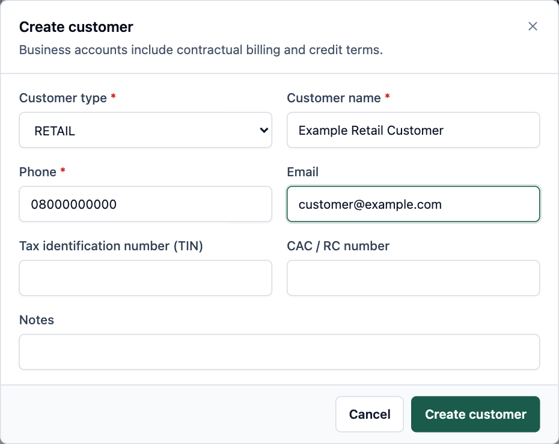
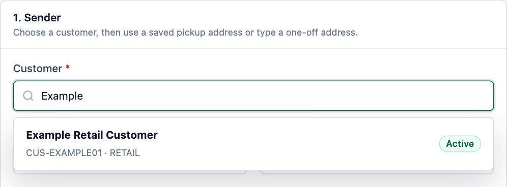

# CESERV Getting Started and Booking Guide

For counter staff, customer service teams and new operators

This guide takes you from signing in to creating a customer and booking a shipment. Start with an existing customer where possible. The system generates the customer code; you do not need to invent one to book a parcel.

**Edition:** 18 September 2026. Menu options depend on your permissions. Screenshots use fictional training data. Sample prices and codes are examples, not your live configuration.

### Open the right workspace

| Workspace | Address and purpose |
| --- | --- |
| Staff application | https://app.ceservlogistics.com/login — bookings, operations and administration |
| Customer portal | https://customer.ceservlogistics.com/login — linked customer shipment and invoice views |
| Public tracking | https://track.ceservlogistics.com/ — tracking by AWB |

1. Open the staff application and enter the work email and password provided by your administrator.
2. Change your temporary password if prompted. Check your name, organization and operating access in **My profile**.
3. Use **Commercial → Customers** to find or create an account. Use **Operations → New booking** to book a shipment.

**If a menu is missing:** ask your administrator to check your role and branch access. A customer account is different from a staff login. Do not share another operator's password.

### Find the instructions you need

| Page | Task |
| --- | --- |
| 2 | Create a customer account |
| 3 | Select the customer and enter addresses |
| 4 | Choose service and packages and record payment and insurance |
| 5 | Enter customs goods and choose who pays |
| 6 | Preview and book and use tracking or the customer portal |

**Before starting:** have the sender and recipient contact details, destination country and postal code, package weight and dimensions, goods description and value, payment arrangement, and any customs information. Confirm what the customer wants before requesting insurance.

<!-- page -->
## Create a customer account

**Where:** Commercial → Customers. Search first by name, phone, email or customer code to avoid creating a duplicate record.

1. Select **Add customer**. Choose **RETAIL** for an individual or **BUSINESS** for a business account.
2. Enter **Customer name** and **Phone**. Add an email address if available. Enter tax or registration details only when applicable.
3. For **BUSINESS**, also enter the agreed **Account code** and **Legal name**. Obtain approved credit and billing settings from finance.
4. Select **Create customer**. The customer detail page opens and shows the generated customer code. Use that code, name, phone or email in the booking search.

{width=5.65}
*Training example. No live customer is created by this illustration.*

**What success looks like:** a customer detail page with a code and **ACTIVE** status. Newly generated codes begin with **CUS-**; older accounts may have other codes.

**No Add customer button:** ask an administrator for customer creation access or ask an authorized colleague to create the record. **Customer code** is generated by the system. A business **Account code** is a separate commercial reference. Neither is a login password.

<!-- page -->
## Select the customer and enter addresses

**Where:** Operations → New booking → **1. Sender**.

1. In **Customer**, type at least two characters of the saved customer name, code, email or phone.
2. Wait for the results, then **click the matching customer**. Typing into the box alone does not select an account.
3. Check that the selected customer's code and name appear below the field. If you change the search text, select a result again.

{width=6.4}
*Training example. Click the matching result before continuing.*

### Complete the sender and recipient

4. Choose a **Saved pickup address**, if available, or enter the sender's contact name, phone and collection address.
5. In **2. Recipient**, enter the delivery contact and address. Select **Destination country** and enter its **Postal code**. For Nigeria, selecting a state fills its capital as the initial city; replace it when the address is in another city.
6. Check the address with the customer. A typed country and postal code still require a serviceability check in the preview.

**Choose a customer still appears:** return to the search and click a result. If there are no results, confirm that the record exists and is active in the correct organization. A suspended or closed account is not offered in the booking lookup.

**Saved addresses:** open the customer's **Addresses** tab and use **Add saved address** when permitted. Pickup addresses must be marked **PICKUP** or **BOTH**. The saved-address form currently uses a six-digit postal code; use the booking's one-off address fields for a destination that needs another format.

<!-- page -->
## Enter service packages payment and insurance

### Service and packages

1. In **3. Service**, select the **Courier product** and enter the **General description of item**. Use a meaningful description of the contents.
2. In **4. Packages**, enter the number of physical boxes and the **Total weight (kg)**. The form splits the total evenly to the nearest gram, assigning any remainder from piece 1. You can still correct each package's measured weight below.
3. Check that the displayed package weights add back to the total. Follow the field labels: booking uses kilograms for weight and centimetres for dimensions. Check any package preset against the parcel actually presented; the preview determines the chargeable weight and price.

### Payment and declared goods value

4. In **5. Payment, goods value & insurance**, choose the agreed payment mode. **PREPAID** is paid in advance; **COD** records an amount to collect at delivery; **CREDIT** uses an approved account arrangement; **TO_PAY** is a pay-later transport arrangement. The system checks whether the selected arrangement is allowed.
5. For **COD**, enter the agreed **COD amount**. Do not assume it equals the declared goods value or the transportation price. Review all three amounts separately.
6. Enter **Total declared goods value** when customs goods lines are not being used. This is the value of the contents, excluding transport charges. Use the currency shown beside the field.

### Record insurance in two steps

7. If the customer requests cover, select **Customer requests shipment insurance** and supply a positive declared goods value.
8. Select **Preview shipment**. Read the returned insurance premium and the complete shipment total to the customer.
9. After the customer agrees, select the insurance acceptance checkbox in the preview. Its wording reflects the configured rate or the quoted premium. Then continue to the final booking check.

**There is no universal 1 percent rate.** The administrator configures the applicable rate-card rules. For illustration, an uncapped 2.5% rule on ₦50,000 would produce a ₦1,250 premium before any other applicable charges. Always use the actual preview.

**If the customer declines:** clear the insurance request, refresh the preview and review the revised total. If any booking input or the quote changes, refresh and obtain acceptance of the current insurance quote again. A saved acceptance records the decision; it is not an insurance certificate or proof of payment.

<!-- page -->
## Complete customs and choose who pays

**Where:** **6. Customs declaration**. Use this when customs details are needed for the shipment. Obtain the contents, origin, value and declaration details from the customer or the responsible shipping team.

1. Select **Include customs declaration**. Enter the invoice reference if supplied, **Customs currency**, **Reason for export** and applicable **Terms of sale**.
2. For each goods line, enter **Description of goods**, whole-number **Quantity**, **Unit of measure**, **Value per unit**, **Country of origin**, and an HS or tariff code when supplied.
3. Use **Add goods line** for different goods. Do not put the entire shipment value into every line. Enter any goods discount, customs freight and other customs charges once in their separate fields.
4. Add the **Declaration statement** where required. Preview the shipment and verify the goods lines and value breakdown before booking.

| Amount shown | What it represents |
| --- | --- |
| Goods subtotal | Quantity multiplied by unit value, added across all goods lines |
| Declared goods value | Goods subtotal less the goods discount |
| Customs invoice total | Declared goods value plus customs freight, insurance premium and other customs charges |
| Shipment total | The transport and other charges returned by the shipment quote |

**Example only:** two items at ₦10,000 each, less a ₦1,000 goods discount, give a declared goods value of ₦19,000. With ₦2,000 customs freight, ₦190 quoted insurance and ₦500 other customs charges, the customs invoice total is ₦21,690. This example assumes a configured 1% insurance rule; it does not set your rate.

### Set the two billing instructions separately

5. Under payment, set **Bill transportation to**: **Shipper**, **Receiver** or **Third party**.
6. Independently set **Bill duty and tax to** using the same choices. Confirm both with the customer; they need not be the same party.
7. For a third party, search and select an authorized active customer account. Receiver transportation on **CREDIT** also requires an identified billing account. Do not type an arbitrary code into an account lookup and leave it unselected.

**Limits:** customs currency must be compatible with the quote; the system does not convert currencies. Customs information and duty-payer instructions are saved, but do not automatically file with customs or assess and collect import duty. Customs freight does not replace the transport rate in the booking quote.

<!-- page -->
## Review book and follow the shipment

### Finish the booking

1. Select **Preview shipment**. Resolve any validation or serviceability message before continuing.
2. In **7. Shipment preview**, check the selected customer, origin and destination, courier product, package count, chargeable weight, payment mode and complete charge breakdown.
3. Check declared value, COD amount, both billing parties, customs values and insurance where applicable. Obtain acceptance of the current insurance premium if insurance is requested.
4. If you edit any input, use **Refresh shipment preview** or **Refresh preview**. Review the updated result and insurance acceptance again.
5. Select **Confirm & book** once and wait for the result. The success screen provides the **AWB**, the shipment reference used for labels and tracking.
6. Use **Label** when available. Choose **4 × 6 sticker labels** for parcel labels, or **A4 courier sheet + customer copy** when the customer needs a receipt copy. Check the printed AWB against the shipment and attach only the parcel label to the correct package. The customer copy shows the server-confirmed shipment charge and is marked as not being a tax invoice. Use **View Shipment** to inspect the saved record or start a new booking.

**Keyboard shortcut:** Ctrl+Enter on Windows, or Command+Enter on Mac, requests a preview and can submit a booking when a current preview is already present. Use it only after the same final checks as the booking button.

**If the connection fails after confirmation:** search **Shipments** by the customer or reference and check whether the booking was saved before creating another. Keep the error message for support. A preview alone does not create a shipment or take a payment.

### Help the customer follow progress

Give the customer the AWB and the public tracking address shown on page 1. Public tracking uses the **AWB**, not the customer code. Internal shipment details may show more operational information than public tracking.

A provisioned customer portal user can sign in and view **Overview**, **Shipments**, **Invoices** and **Profile** for linked accounts. Creating a customer record does not create that login. Ask the administrator to provision and link access; an ordinary staff login is not accepted as a customer portal login.

The current customer portal does not provide self-service booking or address maintenance. Customers should contact the service team for those requests.

**Ready for the next step:** dispatch and warehouse staff should use the Daily Operations Guide. For search errors, prices, codes and permissions, use the Common Questions and Quick Reference guide.
