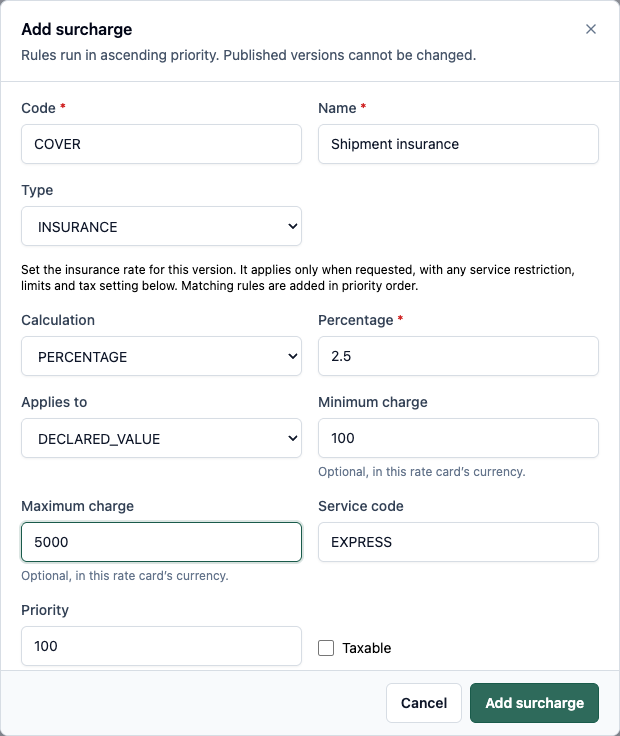

# CESERVE Administrator Configuration Guide

For organization administrators and authorized commercial managers

Configure access, service coverage and pricing before staff take live bookings. This guide explains the available setup screens and the checks that make a configuration usable. Use approved business settings; the sample values in these guides are not company policy.

**Edition:** 18 September 2026. Screens and actions depend on permissions. This guide covers application configuration, not server installation, credentials or insurer policy administration.

### Follow the setup order

| Order | Configuration and owner | Page |
| --- | --- | --- |
| 1 | Staff users, roles and facility access — administrator | 2 |
| 2 | Facilities, postal coverage and routes — network manager | 3 |
| 3 | Courier products and package presets — commercial manager | 4 |
| 4 | Rate cards and complete rate versions — pricing manager | 5 |
| 5 | Insurance rules and quote verification — pricing manager | 6 |
| 6 | Customer accounts, readiness checks and maintenance — administrator and finance | 7 |

### Gather approved information first

Prepare the facility hierarchy and codes, supported countries and postal areas, courier product codes, package limits, route and transit arrangements, pricing zones and lane prices. Obtain finance approval for credit limits, billing terms, taxes, insurance charges and any commission or settlement arrangements.

Staff need their own work email and role. Record which branch or hub each operator may use. Ask the responsible manager to identify who may publish rates, dispatch parcels, accept money, approve financial documents and administer access.

**Open the staff application:** https://app.ceservlogistics.com/login. Configuration is mainly under **Administration**, **Network** and **Commercial**. Missing controls usually require a role or operating-scope review.

**Completion means a verified workflow:** seeing a saved configuration record is not enough. Check a representative serviceability result and a shipment preview with the intended customer and payment arrangement before releasing the configuration to staff. Use an approved training environment for practice transactions.

<!-- page -->
## Give each person the correct access

**Where:** Administration → Users; Administration → Roles & permissions.

1. Open **Users** and select **Add user**.
2. Enter the staff member's full name and work email. Add a phone number if appropriate.
3. Provide a temporary password of at least 12 characters through your organization's approved private channel. The new user is normally required to change it at first sign-in.
4. Select **Initial role**. If that role requires a scope, select the correct **Operating unit**. Save the user.
5. Have the staff member sign in and check **My profile**, the visible menu and the actions required for the job. Confirm that they see the correct facility's work.

### Assign access by responsibility

| Responsibility | Access to review with the administrator |
| --- | --- |
| Counter staff | Customer search or creation, shipment preview and booking, label viewing |
| Dispatch and hub staff | Relevant facility, pickup or delivery runs, scanning, bags, manifests and trips |
| Finance staff | Assigned collections, COD, billing, ledger or settlement functions |
| Configuration manager | Products, coverage, pricing and the authority to activate a rate version |
| Customer portal user | Customer portal permission and an explicit link to the correct customer account |

These are responsibilities, not promises that a particular role name grants every listed action. Review the effective permission list. A role may permit viewing but not creating, approving or publishing.

### Maintain roles and accounts

Review **Roles & permissions** before creating a custom role. System roles are protected. Custom role creation and permission assignment are restricted to what your administrator account may grant.

Use the user detail actions to manage access changes. When someone changes branch or leaves, review their role, operating scope and account status promptly. Never use shared staff credentials to get past a missing button.

**Customer portal access is separate:** a commercial customer record has no password by itself. The customer login must be provisioned and linked to that account. The normal **Add user** staff form does not complete that commercial link. Refer portal provisioning to the system administrator or implementation support when no linking control is available.

<!-- page -->
## Configure facilities coverage and routes

### Build the operating network

1. Use **Network** to create or review the appropriate regions, hubs, branches and franchise facilities. Work from the parent facility down to its children.
2. Check the facility **Code**, **Name**, **Type**, parent and address before saving. Facility codes and types are fixed identities; do not create duplicates to correct an address.
3. Give staff access to the correct operating units. For franchise operations, check the franchise relationship to its active branch as well as user access.

**If a form asks for an ID:** use the actual record ID supplied by your administrator. An operating-unit ID is different from the visible branch code. Keep an approved reference list for the operators who need these fields.

### Establish postal coverage and pricing zones

4. Open the **Postal code master** and search representative collection and delivery areas. Confirm that the required areas exist and belong to the intended locations.
5. Review **Pricing zones**. Create a zone with its code, name, type and sort order when needed. Lane prices refer to these zone codes, so coordinate changes with pricing staff.
6. Use **Bulk import** only with the supported import type and format shown by the application. Inspect accepted and rejected rows and fix the source before retrying rejected records.
7. Confirm postal-to-zone mapping and pickup and delivery coverage. If a required country or mapping cannot be maintained in the available screen, ask implementation support to configure it before offering that lane.

### Configure and verify the route

8. Use **Default routes** to create the supported origin-to-destination route with the correct courier product, mode and transit hours. The current form creates a direct first leg; additional multi-leg arrangements require support where no editing control is available.
9. Use the service-area and temporary-closure controls available from routing configuration to record coverage, effective dates and operational closures. Specify pickup, delivery or both as appropriate.
10. Open **Route planner** and test the origin and destination postal codes with the intended product. Confirm that the route, facilities and serviceability result match the intended movement.

**A country in a dropdown is not proof of service availability.** International destinations also need valid postal data, coverage, zones, routing and prices. A postcode that passes format validation can still be unserviceable. Use route overrides only for an approved exception; ask support about reversal where the current screen has no removal action.

<!-- page -->
## Configure products and package presets

**Where:** Commercial → Courier products; Commercial → Pricing masters.

### Set up the courier product

1. Create or open the required courier product. Review its code, name, transport mode and transit or SLA settings.
2. Set the permitted weight range, weight rounding step, volumetric divisor and any dimension limits. Pay attention to units: configuration may ask for **grams**, while booking asks for **kilograms**.
3. Review the cutoff, effective period and status. Check the product's **COD** and **insurance** eligibility against the approved service offer.
4. Save and verify that the active product appears in **New booking**. Then confirm its route and price for a representative lane.

**Insurance eligibility alone does not create a premium.** An eligible product still needs a matching insurance rule in the applicable active rate-card version. Likewise, a saved product does not create postal coverage or transport rates.

### Set up reusable package types

5. In **Pricing masters**, create or review package presets with a code, name, dimensions, volumetric settings and maximum weight where supported.
6. Use clear names that operators can distinguish, such as an approved small carton or document pack. Check the saved preset in the booking form.
7. Train operators to measure the parcel and correct a preset when needed. A preset speeds entry; it does not certify the actual weight or contents.

### Understand chargeable weight

The preview compares actual and volumetric weight and applies the configured charging and rounding rules. A large lightweight carton can cost more than its scale weight suggests. Staff should read the chargeable weight and price explanation rather than manually replace the total.

### Use pricing masters for their intended role

State-wise base costs provide a fallback where a more specific configured lane or slab is not used. Do not assume that changing a state-wise base cost overrides an existing rate-card lane. Test with the actual customer and service to confirm which rule applies.

**Before publishing a service:** verify one normal parcel, a larger volumetric parcel, a boundary weight and an unsupported lane in an approved training setup. Confirm that the system accepts, prices or rejects each case as intended. Record the product and rate version used so staff know which configuration is effective.

<!-- page -->
## Publish a complete rate card version

**Where:** Commercial → Rate cards. Publication changes the prices used by applicable new quotes, so use the approved commercial schedule and effective dates.

1. Create or select the rate card. Review its code, name and **Scope**: **RETAIL**, **BUSINESS** or **FRANCHISE**. Check any customer or franchise assignment and the default retail choice.
2. Open the card and choose **Create draft version**. Enter the effective dates and a useful change note.
3. Populate every required lane using **Set lane rate**. Select the service and origin and destination zones, then enter the base weight, base price, additional step, additional price and minimum chargeable weight as applicable.
4. Use **Add surcharge** for each approved fuel, handling, insurance or other rule that belongs in the version. Review the basis, service restriction, limits, priority and tax treatment.
5. Review the entire draft against the approved schedule. When ready, select **Activate version** and read the publication confirmation before completing it.
6. Run the **Pricing simulator** and a booking preview using the intended customer, lane, product, package measurements and payment arrangement. Confirm the returned breakdown and effective version where shown.

**A new draft starts empty.** It does not automatically copy all lanes and surcharges from the previous version. Re-enter the complete intended configuration before activation. Adding only a new insurance rule can leave the new version without required transport pricing.

### Read the units correctly

| Input | How to enter it |
| --- | --- |
| Base weight and additional step | Grams when the configuration label says g |
| Price and fixed charge | Normal currency amounts as displayed, such as 1500.00 |
| Percentage | Enter 2.5 for 2.5 percent, not 0.025 or 250 |
| Origin and destination zone | Configured zone code, not a town name or postal code |
| Service code | The existing courier product code |

**After activation:** the version is immutable. Correct a published schedule with a new complete draft and an approved effective date. Historical bookings retain their saved commercial information; changing a future rate is not a way to rewrite an old charge.

**If no price is found:** check the card assignment, active dates, product and zone codes, lane direction and weight rules. A route can be serviceable while its applicable price is missing. Resolve the configuration instead of substituting an unrelated customer's rate.

<!-- page -->
## Configure shipment insurance

**Where:** Commercial → Rate cards → selected card → draft version → **Add surcharge**. First confirm that the courier product permits insurance.

1. Enter a clear **Code** and **Name**. Set **Type** to **INSURANCE**.
2. For a percentage of goods value, set **Calculation** to **PERCENTAGE**, enter the approved **Percentage**, and set **Applies to** to **DECLARED_VALUE**.
3. Enter an optional minimum and maximum charge in the card's currency. Restrict **Service code** if needed. Set priority and **Taxable** according to the approved schedule.
4. Select **Add surcharge**. Complete the remaining rates and rules, review the draft and activate the version as described on page 5.

{width=3.85}
*Illustration only. The 2.5% rate and limits are not prescribed settings.*

**Rules can add together.** A service-specific rule does not automatically replace a matching unrestricted rule. Check for unintended overlaps. Fixed and per-kilogram insurance calculations are also supported; the customer's acceptance may show a premium amount rather than a simple percentage.

**Verify:** preview the same shipment without insurance and then with insurance and a positive declared value. Check the premium, any limits and taxes, and the final total. Booking insurance also requires the customer's acceptance of the current quote. If no eligible rule exists, the application reports that insurance is not configured; it does not fall back to 1%.

<!-- page -->
## Prepare customer accounts and release the setup

### Commercial accounts and finance arrangements

1. Use **Commercial → Customers → Add customer** for retail and business records. Business accounts need an **Account code** and **Legal name** in addition to the contact details.
2. Set the approved credit limit, payment terms, billing cycle and rate-card assignment where applicable. Review the customer's **Billing** tab and authorized credit-term controls.
3. Confirm the account is active before booking. Test **CREDIT** only with an eligible billing account. Third-party payers must be active authorized accounts in the same organization.
4. Ask finance to review tax treatment, commission, ledger and settlement configuration before using those financial workflows. Where the application has no configuration control, use implementation support; do not alter booking totals to simulate a missing rule.

### Check readiness with the people who will use it

- **Counter staff:** can create or select an active customer, enter addresses, preview a price, capture insurance acceptance and see the resulting AWB in an approved practice booking.
- **Operations:** can access the correct facility, identify IDs requested by the forms, scan with an Enter suffix, and follow the bag, manifest, trip and receiving workflow.
- **Dispatch:** can assign an authorized pickup or delivery agent and see the appropriate run and stop actions.
- **Finance:** can distinguish prepaid customer collections from COD, review billing parties and amounts, and identify who is allowed to approve or accept each financial action.
- **Support:** knows the approved escalation contact, live application address and exact details to collect when a user is blocked.

### Review the configuration regularly

Review staff access when roles change, effective dates before rate changes, unresolved coverage errors, account status and credit restrictions, and operational closures. After a change, repeat the relevant preview or route check and brief the affected staff.

Customer notifications require configured providers and delivery settings. A saved template or enabled trigger alone is not proof that a real SMS, WhatsApp message or email was delivered. Verify the relevant delivery record and provider setup with support.

**Current boundaries:** customer login linking may require administrator support outside the visible form; invoice PDF rendering is unavailable in the current billing screen; customs details do not perform duty assessment or electronic filing; saved-address and bulk geography forms have domestic-oriented limits. Escalate these needs rather than describing them to users as completed features.
