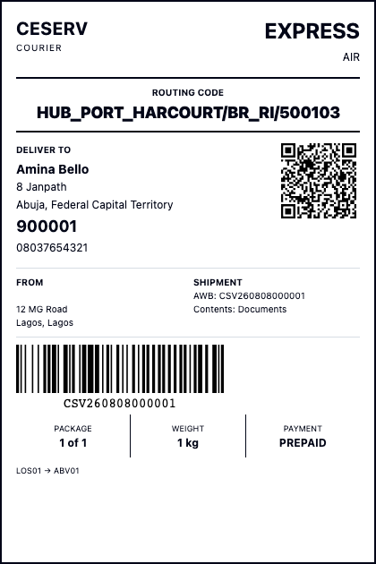
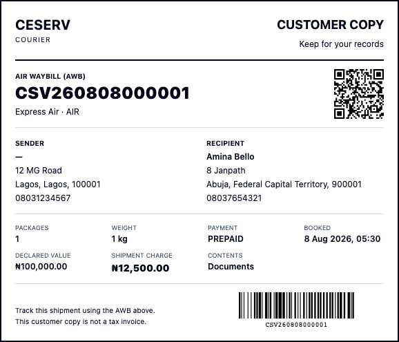

# CESERV Complete Product Walkthrough

For new users supervisors customers and franchise teams

CESERV manages the courier business from customer setup and booking through physical movement, delivery, returns and financial records. It also provides network and pricing configuration, customer and franchise portals, management reports, notifications and partner integrations. This manual introduces the whole product and walks through the customer-facing work.

**Edition:** 18 September 2026. Read this with the Configuration and Administration, Operations Finance and Reporting, and Questions and Support manuals. Together they replace the earlier limited guide pack. Available actions depend on your role, operating scope, configuration and record status.

### Open the correct workspace

Staff sign in at https://app.ceservlogistics.com/login. Provisioned customer users sign in at https://customer.ceservlogistics.com/login. Public shipment tracking is at https://track.ceservlogistics.com/. Franchise users use their administrator-provided workspace and assigned login.

Use your own account. On first sign-in, complete any required password change. Use **Forgot password?** if necessary; contact the administrator if the reset message does not arrive. A commercial customer account does not automatically create a login.

### Find your walkthrough

| Topic | Page |
| --- | --- |
| Operations network and commercial product map | 2 |
| Finance administration reports and portals | 3 |
| Roles and the complete shipment journey | 4 |
| Create and select customers and addresses | 5 to 6 |
| Service packages payment insurance and customs | 7 to 8 |
| Confirm booking and manage the saved shipment | 9 to 10 |
| Customer and franchise portal walkthroughs | 11 to 12 |

**How to use these manuals:** bold text identifies screen labels and actions. Examples are training examples, not live prices or company policy. Screenshots use fictional training data. A described capability is not proof that it is configured for your organization. Check the visible record and the application's response before considering an action complete.

<!-- page -->
## Explore operations network and commercial work

The staff sidebar groups related work. A menu can be hidden because your role does not include the required permission. Secondary workspaces are reached through links or tabs on the main page.

### Operations

| Workspace | What you do there |
| --- | --- |
| Shipments and New booking | Search saved bookings; inspect their route, prices and history; book, print labels or cancel an eligible shipment |
| Pickups | Raise collection requests; assign agents and pickup runs; record actual visit outcomes |
| Scanner | Receive, sort, record movement, hold, release and record exceptions at the current facility |
| Bags and Manifests | Group parcels for movement; close declarations; verify seals and receive contents |
| Trips | Assign fleet resources, attach manifests and record transport departure and arrival; open Fleet and carriers from here |
| Hub operations and Destination | Receive and reconcile inbound work, resolve exceptions, sort parcels and prepare destination delivery |
| Delivery and POD | Build and dispatch runs; record delivery attempts, verification, COD and evidence |
| NDR and RTO | Decide the next action after failed delivery; manage the return journey and sender handover |
| Command centre | Review period activity, current backlog and exception signals before opening the relevant work queue |

### Network and commercial

**Network** contains Hubs, Branches, Franchises, Geography, Route planner, Default routes and Route overrides. Geography links to postal codes, pricing zones and imports. Routing includes service areas and temporary closures. Together these determine where a product can operate and through which facilities.

**Commercial** contains Customers, Courier products, Pricing masters, Rate cards and Pricing simulator. Customer records identify the commercial relationship. Products define the courier service and parcel limits. Pricing masters and rate versions supply the charges. The simulator and booking preview check the result before a booking is committed.

**Read next:** Configuration and Administration explains setup. Operations Finance and Reporting explains every physical handling stage. The rest of this walkthrough covers the customer, booking and portal experience.

<!-- page -->
## Explore finance administration and customer access

### Finance

| Workspace | Purpose and related screens |
| --- | --- |
| Customer collections | Record eligible origin or franchise shipment payments and their references |
| Commission | Configure rules and dated versions; simulate amounts; inspect calculated or posted entries and permitted reversals |
| Ledger | Chart of accounts, account statements, journals, journal detail, trial balance and accounting period status |
| COD control | Follow delivery collection obligations, the accountable cash holder and custody reconciliation |
| Settlements | Generate a franchise statement; review source lines; submit, approve and record payment |
| Billing | Draft and issue customer invoices, apply payments and raise credit or debit notes |

### Administration and reports

**Users** manages staff identity, state and role assignments. **Roles & permissions** shows what each role may do and its scope. **Organization** maintains editable organization details and shows fixed identifiers such as the AWB prefix and currency.

The four notification workspaces manage templates and previews, show milestone coverage, show channel health, and expose message delivery evidence. The three integration workspaces manage API credentials, webhook endpoints and delivery attempts. A webhook is an automated event sent to a connected partner system.

**Report centre** provides queued exports for operations, SLA, franchise performance, finance, COD, commission, settlements and exceptions. Choose an available report and its filters, wait for completion, then download. Report availability is permission controlled.

### Portals and public tracking

Customer users can see linked account summaries, shipment history, customer-safe tracking, invoices and profile. Franchise users can see their commercial position, origin or destination shipment workload and settlements, with permitted links into operational workspaces. Anyone with an AWB can use public tracking.

**Current boundaries:** the customer portal does not offer self-service booking, pickup requests, price estimates, address maintenance or customer-scoped POD download. Invoice PDF generation and several finance correction or queue screens are unavailable. Providers and external integrations require deployment setup. These boundaries are explained beside the relevant workflow in the other manuals; a menu title does not imply every possible action is supported.

<!-- page -->
## Understand roles and the complete journey

Your organization decides who is responsible for each stage. The responsibilities below are a training map, not a guarantee of permissions attached to a role name.

| Team | Main responsibility |
| --- | --- |
| Administrator and network manager | Identity, access, facilities, coverage, routes and operational readiness |
| Commercial and counter teams | Customers, products, approved prices, booking instructions and correct labels |
| Pickup and origin operations | Actual collection, receipt, custody, sorting and outbound declarations |
| Transport and hub teams | Loaded movements, receiving, counts, exceptions and onward dispatch |
| Destination and delivery teams | Runs, physical delivery attempts, verification, cash collected and evidence |
| Support and return teams | Customer communication, NDR decisions and accountable return to sender |
| Finance and management | Collections, commission, ledger, COD, settlements, billing and reporting |

### Follow one parcel through the business

1. **Prepare:** establish an active customer, service, coverage, route and applicable rates. Grant staff access to the relevant facilities.
2. **Book:** select the customer, capture addresses and packages, agree payment and insurance, preview and confirm. The system creates the AWB and saved commercial snapshots.
3. **Collect and move:** record pickup or origin receipt. Scan, bag and manifest eligible parcels, attach the movement to a trip and record actual departure.
4. **Receive:** record arrival and separately receive containers and reconcile physical contents. Resolve discrepancies before onward movement.
5. **Deliver or resolve:** dispatch the destination run. Record the actual attempt and any COD. Capture POD. Failed attempts lead to NDR decisions and, when authorized, RTO.
6. **Account and review:** reconcile money, review earned commission, post or inspect financial records, issue invoices, settle franchise balances and produce reports.

**Keep four facts separate:** the parcel's physical location, its recorded status, the money received, and the party responsible for that money. Booking does not collect cash; arrival does not receive every parcel; a draft financial record is not a posted record.

Open **My profile** to review your identity, organization, access scope and active sessions. When a menu or action is missing, tell the administrator the intended task and facility. Screen access and approval authority may be different permissions.

<!-- page -->
## Create a customer account

**Where:** Commercial → Customers. Search first by name, phone, email or customer code to avoid creating a duplicate record.

1. Select **Add customer**. Choose **RETAIL** for an individual or **BUSINESS** for a business account.
2. Enter **Customer name** and **Phone**. Add an email address if available. Enter tax or registration details only when applicable.
3. For **BUSINESS**, also enter the agreed **Account code** and **Legal name**. Obtain approved credit and billing settings from finance.
4. Select **Create customer**. The customer detail page opens and shows the generated customer code. Use that code, name, phone or email in the booking search.

{width=5.65}
*Training example. No live customer is created by this illustration.*

**What success looks like:** a customer detail page with a code and **ACTIVE** status. Newly generated codes begin with **CUS-**; older accounts may have other codes.

**No Add customer button:** ask an administrator for customer creation access or ask an authorized colleague to create the record. **Customer code** is generated by the system. A business **Account code** is a separate commercial reference. Neither is a login password.

<!-- page -->
## Select the customer and enter addresses

**Where:** Operations → New booking → **1. Sender**.

1. In **Customer**, type at least two characters of the saved customer name, code, email or phone.
2. Wait for the results, then **click the matching customer**. Typing into the box alone does not select an account.
3. Check that the selected customer's code and name appear below the field. If you change the search text, select a result again.

{width=6.4}
*Training example. Click the matching result before continuing.*

### Complete the sender and recipient

4. Choose a **Saved pickup address**, if available, or enter the sender's contact name, phone and collection address.
5. In **2. Recipient**, enter the delivery contact and address. Select **Destination country** and enter its **Postal code**. Complete the state and city fields presented for that country.
6. Check the address with the customer. A typed country and postal code still require a serviceability check in the preview.

**Choose a customer still appears:** return to the search and click a result. If there are no results, confirm that the record exists and is active in the correct organization. A suspended or closed account is not offered in the booking lookup.

**Saved addresses:** open the customer's **Addresses** tab and use **Add saved address** when permitted. Pickup addresses must be marked **PICKUP** or **BOTH**. The saved-address form currently uses a six-digit postal code; use the booking's one-off address fields for a destination that needs another format.

<!-- page -->
## Enter service packages payment and insurance

### Service and packages

1. In **3. Service**, select the **Courier product** and enter the **General description of item**. Use a meaningful description of the contents.
2. In **4. Packages**, enter every package and its actual weight. Follow the field labels: booking uses kilograms for weight and centimetres for dimensions.
3. Check any package preset against the parcel actually presented. Enter correct measurements; the preview determines the chargeable weight and price.

### Payment and declared goods value

4. In **5. Payment, goods value & insurance**, choose the agreed payment mode. **PREPAID** is paid in advance; **COD** records an amount to collect at delivery; **CREDIT** uses an approved account arrangement; **TO_PAY** is a pay-later transport arrangement. The system checks whether the selected arrangement is allowed.
5. For **COD**, enter the agreed **COD amount**. Do not assume it equals the declared goods value or the transportation price. Review all three amounts separately.
6. Enter **Total declared goods value** when customs goods lines are not being used. This is the value of the contents, excluding transport charges. Use the currency shown beside the field.

### Record insurance in two steps

7. If the customer requests cover, select **Customer requests shipment insurance** and supply a positive declared goods value.
8. Select **Preview shipment**. Read the returned insurance premium and the complete shipment total to the customer.
9. After the customer agrees, select the insurance acceptance checkbox in the preview. Its wording reflects the configured rate or the quoted premium. Then continue to the final booking check.

**There is no universal 1 percent rate.** The administrator configures the applicable rate-card rules. For illustration, an uncapped 2.5% rule on ₦50,000 would produce a ₦1,250 premium before any other applicable charges. Always use the actual preview.

**If the customer declines:** clear the insurance request, refresh the preview and review the revised total. If any booking input or the quote changes, refresh and obtain acceptance of the current insurance quote again. A saved acceptance records the decision; it is not an insurance certificate or proof of payment.

<!-- page -->
## Complete customs and choose who pays

**Where:** **6. Customs declaration**. Use this when customs details are needed for the shipment. Obtain the contents, origin, value and declaration details from the customer or the responsible shipping team.

1. Select **Include customs declaration**. Enter the invoice reference if supplied, **Customs currency**, **Reason for export** and applicable **Terms of sale**.
2. For each goods line, enter **Description of goods**, whole-number **Quantity**, **Unit of measure**, **Value per unit**, **Country of origin**, and an HS or tariff code when supplied.
3. Use **Add goods line** for different goods. Do not put the entire shipment value into every line. Enter any goods discount, customs freight and other customs charges once in their separate fields.
4. Add the **Declaration statement** where required. Preview the shipment and verify the goods lines and value breakdown before booking.

| Amount shown | What it represents |
| --- | --- |
| Goods subtotal | Quantity multiplied by unit value, added across all goods lines |
| Declared goods value | Goods subtotal less the goods discount |
| Customs invoice total | Declared goods value plus customs freight, insurance premium and other customs charges |
| Shipment total | The transport and other charges returned by the shipment quote |

**Example only:** two items at ₦10,000 each, less a ₦1,000 goods discount, give a declared goods value of ₦19,000. With ₦2,000 customs freight, ₦190 quoted insurance and ₦500 other customs charges, the customs invoice total is ₦21,690. This example assumes a configured 1% insurance rule; it does not set your rate.

### Set the two billing instructions separately

5. Under payment, set **Bill transportation to**: **Shipper**, **Receiver** or **Third party**.
6. Independently set **Bill duty and tax to** using the same choices. Confirm both with the customer; they need not be the same party.
7. For a third party, search and select an authorized active customer account. Receiver transportation on **CREDIT** also requires an identified billing account. Do not type an arbitrary code into an account lookup and leave it unselected.

**Limits:** customs currency must be compatible with the quote; the system does not convert currencies. Customs information and duty-payer instructions are saved, but do not automatically file with customs or assess and collect import duty. Customs freight does not replace the transport rate in the booking quote.

<!-- page -->
## Review book and follow the shipment

### Finish the booking

1. Select **Preview shipment**. Resolve any validation or serviceability message before continuing.
2. In **7. Shipment preview**, check the selected customer, origin and destination, courier product, package count, chargeable weight, payment mode and complete charge breakdown.
3. Check declared value, COD amount, both billing parties, customs values and insurance where applicable. Obtain acceptance of the current insurance premium if insurance is requested.
4. If you edit any input, use **Refresh shipment preview** or **Refresh preview**. Review the updated result and insurance acceptance again.
5. Select **Confirm & book** once and wait for the result. The success screen provides the **AWB**, the shipment reference used for labels and tracking.
6. Use the label action when available, check the printed AWB against the shipment, and attach the label to the correct parcel. Use **View Shipment** to inspect the saved record or start a new booking.

**Keyboard shortcut:** Ctrl+Enter on Windows, or Command+Enter on Mac, requests a preview and can submit a booking when a current preview is already present. Use it only after the same final checks as the booking button.

**If the connection fails after confirmation:** search **Shipments** by the customer or reference and check whether the booking was saved before creating another. Keep the error message for support. A preview alone does not create a shipment or take a payment.

### Help the customer follow progress

Give the customer the AWB and the public tracking address shown on page 1. Public tracking uses the **AWB**, not the customer code. Internal shipment details may show more operational information than public tracking.

A provisioned customer portal user can sign in and view **Overview**, **Shipments**, **Invoices** and **Profile** for linked accounts. Creating a customer record does not create that login. Ask the administrator to provision and link access; an ordinary staff login is not accepted as a customer portal login.

The current customer portal does not provide self-service booking or address maintenance. Customers should contact the service team for those requests.

**Ready for the next step:** dispatch and warehouse staff should use the Operations Finance and Reporting manual. For search errors, prices, codes and permissions, use the Questions and Support manual.

<!-- page -->
## Find manage and label a saved shipment

**Where:** Operations → Shipments. Use this register to answer what was booked, what the customer agreed to and what has happened since.

1. Search by AWB or reference. Narrow the register using status, customer ID, service code and booked dates as needed. Clear an old filter before concluding that a shipment is missing.
2. Open the AWB. Check the customer, service, piece count, payment mode, promised delivery and current status before taking action.
3. Review the available detail sections: summary, route, packages, charges, tracking, parties and audit. The booking route, addresses and charges preserve the information saved at booking.
4. Inspect **Insurance, billing & customs** for the declared goods value, quoted cover and acceptance, billing parties and customs details. Use the saved record when answering a question about that particular booking.
5. Read tracking events in time order and correlate them with the current facility and physical parcel. The administrative audit records actions separately from the movement timeline.

### Print the correct label

Use **Label** on the shipment detail where permitted. Select **4 × 6 sticker labels** for the parcels, **A4 courier sheet + customer copy** for a printable customer record, or download ZPL for a compatible label printer. The customer copy includes the AWB, sender and recipient, package details, declared value and the final server-calculated shipment charge. It is a shipment record, not a tax invoice. Check one printed label for legibility and scan it in an appropriate verification process before a batch.

Print one scannable label for each package. Match the AWB and package reference to the physical parcel before attaching it. Reprinting a label does not create a new booking. If a label cannot be loaded, keep the AWB and error, check the printer or browser print settings, and contact support rather than inventing a barcode.

### Cancel an eligible booking

Only an authorized user may cancel when the action is offered and the shipment is eligible. Open **Cancel shipment**, check the AWB, enter a substantive reason and confirm. Cancellation is terminal and releases reserved credit for a credit booking. Verify the final status before telling the customer it is cancelled.

If movement has already made cancellation invalid, follow the authorized operations or return process. Do not assume cancelling the booking reverses every collection, posted financial document or physical handover. Finance and operations must review those records separately.

**If information is wrong:** while a shipment is still **Booked**, an authorized user can use **Edit** to correct the permitted reference, contact, address and declaration fields without changing the AWB. A correction reason is required and the audit trail preserves the original booking. Route, service, package, payment and financial changes still require the supported cancellation, rebooking or exception process.

<!-- page -->
## Use the customer portal

**Audience:** a provisioned customer user linked to one or more commercial accounts. This is a simpler view of the customer's own business with the courier.

### Start with Overview

1. Sign in using the customer portal address and your assigned customer login. A staff login or a newly created commercial customer record alone is insufficient.
2. Open **Overview** and check the linked account and period shown. Review active shipments, deliveries, exceptions and outstanding invoices, then read recent activity.
3. Check **Account position** where available. If activity belongs to the wrong account or expected accounts are absent, stop and ask the account team to review the login-to-customer link.

### Track shipments and review invoices

4. Open **Shipments**. Search by tracking number or reference and use the status filter to narrow the results.
5. Open a shipment to read its customer-friendly journey, current milestone and available summary. Internal handling details may not appear in this view.
6. Open **Invoices** and review invoice dates, payment state, total and outstanding balance. This screen is an account view; do not assume that reading an invoice takes a payment or provides a downloadable invoice PDF.
7. Open **Profile** to confirm the sign-in identity and linked commercial account. Ask the account team to correct links or commercial information when there is no editable control.

### Request help from the account team

For new bookings, estimates, collection requests, saved-address changes or POD requests, contact the account team. Those customer self-service actions are not available in this portal version. Staff may perform supported tasks through their own authorized workspaces.

If a shipment is missing, check its AWB and whether it belongs to a linked account. An empty result can mean a filter, account link or access issue; it does not prove the shipment never existed. Provide the AWB, your account name and the relevant screen to support, without sharing your password.

### Share public tracking

Give the recipient the AWB and https://track.ceservlogistics.com/. The recipient does not need the commercial customer code. Public tracking intentionally shows a limited journey and may return a generic not-found response. Confirm the AWB before contacting support; do not send internal account or financial screenshots to a recipient.

<!-- page -->
## Use the franchise portal

**Audience:** a provisioned franchise user with the appropriate franchise and operating-unit relationship. The dashboard brings franchise commercial information together, while operational actions use the same controlled workflows as staff.

1. Open the assigned franchise workspace. Confirm the franchise name and period before reading the dashboard.
2. Review bookings, delivered shipments, NDR or exceptions, COD outstanding, commission outstanding and settlement due. Read each metric's period and meaning; they are not all physical queues.
3. Use **Quick actions** to open the tasks your role permits. These may link to booking, pickup, scanner, bags, manifests, delivery or finance workspaces. The operational manuals still apply.
4. Open **Shipments** and choose the relationship filter. **ORIGIN** means booked here; **DESTINATION** means inbound delivery responsibility; **ANY** covers either relationship. Then apply status filters.
5. Open **Settlements** to inspect the statement period, status, signed net, amount paid and remaining balance. Approval and payment are performed through the authorized Finance workflow, not by changing the displayed balance.
6. Open **Profile** to review the franchise and sign-in relationship. Report incorrect mappings to the administrator.

### Separate the franchise money positions

**Customer collections** record eligible prepaid transport receipts at the franchise. **COD** follows money collected from recipients and its custody. **Commission** records earned amounts under rules. **Settlement** determines the approved net amount due between head office and the franchise. These are related, but one record does not replace the others.

Read the explicit settlement direction in the Finance detail: **Head Office pays Franchise** or **Franchise pays Head Office**. Confirm actual payment separately. An outstanding commission total is not necessarily the amount payable after COD liability, charges and other settlement lines.

### When the workload seems wrong

Check the period, relationship filter, status and assigned operating unit. The dashboard does not provide distinct counters for every pickup, bag, manifest, inbound or outbound queue. Open the corresponding operational workspace to review the actual work.

If a quick action is missing, request the required task and scope from the administrator. Do not use another branch's credentials. For shift work, follow the Operations Finance and Reporting manual; for franchise setup and user access, follow Configuration and Administration.
